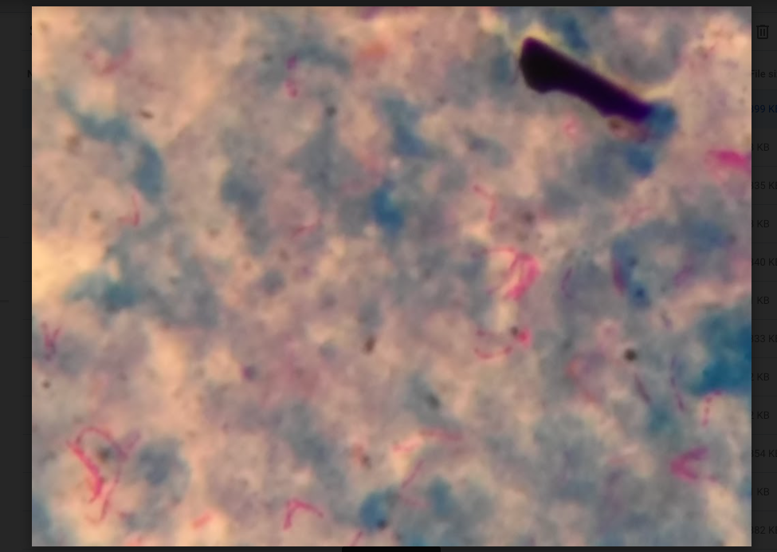
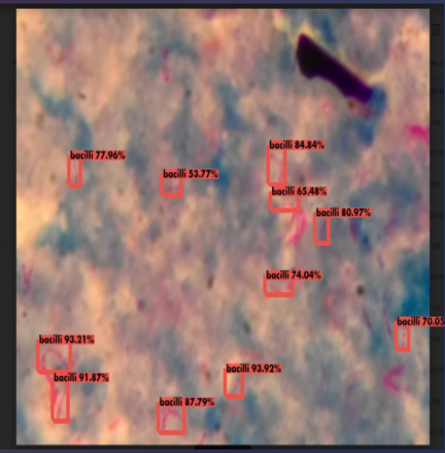

# TB detection using Yolov3 Model with Flask and Tensorflow 2.0 (APIs and Detections)
Yolov3 is an algorithm that uses deep convolutional neural networks to perform object detection. This repository implements Yolov3 using TensorFlow 2.0 and creates two easy-to-use APIs that you can integrate into web or mobile applications. <br>
# Input

# Output



##  Setting up

#### Conda (Recommended)

```bash
# Tensorflow CPU
conda env create -f conda-cpu.yml
conda activate yolov3-cpu

# Tensorflow GPU
conda env create -f conda-gpu.yml
conda activate yolov3-gpu
```

#### Pip
```bash
# TensorFlow CPU
pip install -r requirements.txt

# TensorFlow GPU
pip install -r requirements-gpu.txt
```

### Weights
Adding tflite model in weights directory. 

### Starting the app
```bash
cd into the directory
python app.py
```
